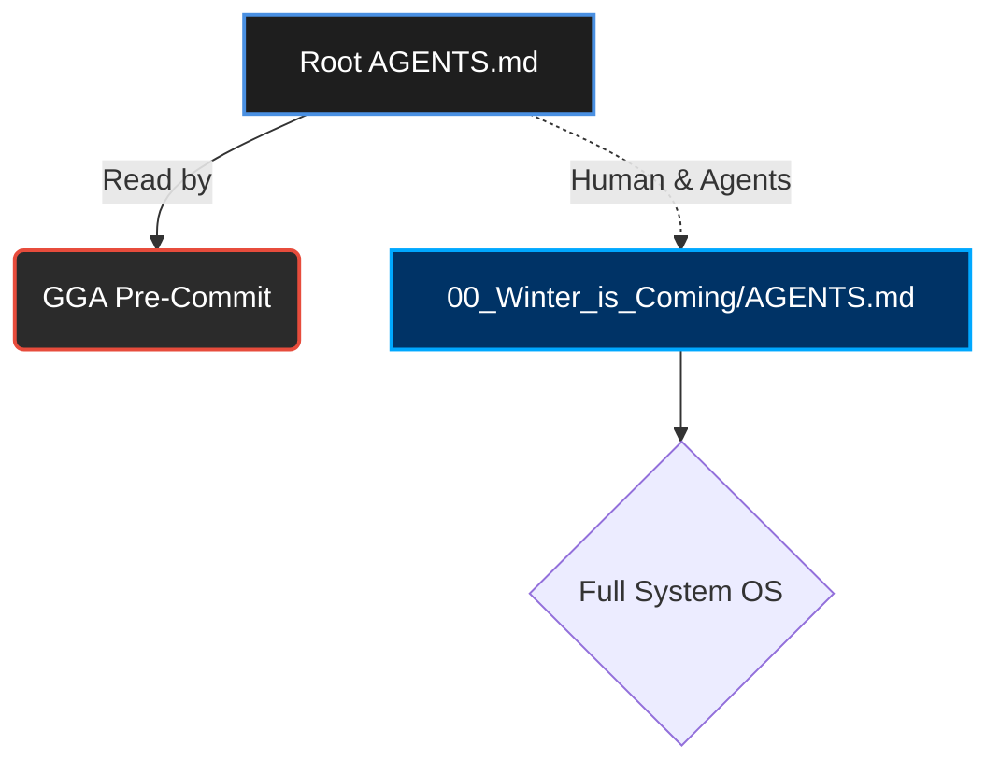

<<<<<<< HEAD
# 🛡️ Guardian Angel Entrypoint (GGA)

> [!CAUTION]
> **SYSTEM REDIRECT:** The main agent rules and OS capabilities are located in the [Matrix Core (Winter is Coming)](file:///c:/Users/sebas/Downloads/01%20Revisar/09%20Versiones/00%20Respaldo%20PC%20Sebas/01%20Github/personal-os/Think_Different/00_Winter_is_Coming/AGENTS.md). 
> This file exists in the root **exclusively** as a configuration loader for the **GGA (Guardian Angel) Pre-Commit Hook**.

---

## 🧭 Flow & Architecture

---

## ⚡ Code Review Rules (For GGA)

> [!IMPORTANT]
> The following rules must be enforced by Guardian Angel on every commit constraint check.

### TypeScript / JavaScript
- ✅ **Use `const` or `let`**.
- ❌ **NEVER use `var`**.
- ✅ **Prefer `interfaces` over `types`** for object structures.
- ❌ **No `any` types allowed** under any circumstances (Strict typing).

### React / Frontend
- ✅ **Use Functional Components** exclusively.
- ✅ **Prefer Named Exports** over default exports to ensure predictable refactoring and IntelliSense.

---
*Generated by Think Different PersonalOS v6.1 | Pure Green State*
=======
# Engram — Agent Skills Index

When working on this project, load the relevant skill(s) BEFORE writing any code.

## How to Use

1. Check the trigger column to find skills that match your current task
2. Load the skill by reading the SKILL.md file at the listed path
3. Follow ALL patterns and rules from the loaded skill
4. Multiple skills can apply simultaneously

## Skills

| Skill                            | Trigger                                                                                                  | Path                                                                                 |
|----------------------------------|----------------------------------------------------------------------------------------------------------|--------------------------------------------------------------------------------------|
| `engram-architecture-guardrails` | Any change that affects system boundaries, ownership, state flow, or cross-package responsibilities.     | [`skills/architecture-guardrails/SKILL.md`](skills/architecture-guardrails/SKILL.md) |
| `engram-branch-pr`               | When creating a pull request, opening a PR, or preparing changes for review.                             | [`skills/branch-pr/SKILL.md`](skills/branch-pr/SKILL.md)                             |
| `engram-business-rules`          | Any change that affects sync behavior, project controls, permissions, or memory semantics.               | [`skills/business-rules/SKILL.md`](skills/business-rules/SKILL.md)                   |
| `engram-commit-hygiene`          | Any commit creation, review, or branch cleanup.                                                          | [`skills/commit-hygiene/SKILL.md`](skills/commit-hygiene/SKILL.md)                   |
| `engram-cultural-norms`          | Starting substantial work, reviewing changes, or defining team conventions.                              | [`skills/cultural-norms/SKILL.md`](skills/cultural-norms/SKILL.md)                   |
| `engram-dashboard-htmx`          | Any change to htmx attributes, partial updates, forms, or server-rendered browser UI.                    | [`skills/dashboard-htmx/SKILL.md`](skills/dashboard-htmx/SKILL.md)                   |
| `engram-docs-alignment`          | Any code or workflow change that affects user or contributor behavior.                                   | [`skills/docs-alignment/SKILL.md`](skills/docs-alignment/SKILL.md)                   |
| `engram-issue-creation`          | When creating a GitHub issue, reporting a bug, or requesting a feature.                                  | [`skills/issue-creation/SKILL.md`](skills/issue-creation/SKILL.md)                   |
| `engram-memory-protocol`         | Decisions, bugfixes, discoveries, preferences, or session closure.                                       | [`skills/memory-protocol/SKILL.md`](skills/memory-protocol/SKILL.md)                 |
| `engram-plugin-thin`             | Changes in plugin scripts/hooks for Claude, OpenCode, Gemini, or Codex.                                  | [`skills/plugin-thin/SKILL.md`](skills/plugin-thin/SKILL.md)                         |
| `engram-pr-review-deep`          | Reviewing any external or internal contribution before merge.                                            | [`skills/pr-review-deep/SKILL.md`](skills/pr-review-deep/SKILL.md)                   |
| `engram-project-structure`       | Creating files, packages, handlers, templates, styles, or tests in this repo.                            | [`skills/project-structure/SKILL.md`](skills/project-structure/SKILL.md)             |
| `engram-sdd-flow`                | When user requests SDD or multi-phase implementation planning.                                           | [`skills/sdd-flow/SKILL.md`](skills/sdd-flow/SKILL.md)                               |
| `engram-server-api`              | Any route, handler, payload, or status code modification.                                                | [`skills/server-api/SKILL.md`](skills/server-api/SKILL.md)                           |
| `engram-testing-coverage`        | When implementing behavior changes in any package.                                                       | [`skills/testing-coverage/SKILL.md`](skills/testing-coverage/SKILL.md)               |
| `engram-tui-quality`             | Changes in model, update, view, navigation, or rendering.                                                | [`skills/tui-quality/SKILL.md`](skills/tui-quality/SKILL.md)                         |
| `engram-ui-elements`             | Adding or changing dashboard UI components or connected browsing flows.                                  | [`skills/ui-elements/SKILL.md`](skills/ui-elements/SKILL.md)                         |
| `engram-visual-language`         | Any dashboard styling, typography, spacing, or visual identity change.                                   | [`skills/visual-language/SKILL.md`](skills/visual-language/SKILL.md)                 |
| `engram-backlog-triage`          | Auditing open issues or PRs, triaging the backlog, or reviewing contributor submissions as a maintainer. | [`skills/backlog-triage/SKILL.md`](skills/backlog-triage/SKILL.md)                   |
| `gentleman-bubbletea`            | When editing Go files in installer/internal/tui/, working on TUI screens, or adding new UI features.     | [`skills/gentleman-bubbletea/SKILL.md`](skills/gentleman-bubbletea/SKILL.md)         |
>>>>>>> 32cca8b5fd9fa09d5d0070885b9991b819c83175
